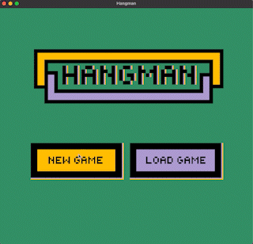

# Hangman

A Ruby project from [The Odin Project](https://www.theodinproject.com/lessons/ruby-tic-tac-toe)

Written with the AWESOME [Ruby2D](http://www.ruby2d.com/) framework



This is a simple Hangman game built using Ruby2D where the player plays against the computer.

## Goals

- Learn more Ruby2D framework
- Learn more about game coordinate systems in 2D computer graphics.
- Learn file serialization and how to utilize a 'save' functionality for games.
- Integrate game logic with graphics.
- Increase pixel art creating skills.
- And as always, have fun and keep improving Ruby programming knowledge.

## Installation and Setup

Make sure you have installed:

* [ruby2d](https://github.com/ruby2d/ruby2d):

```
gem install ruby2d
```

Clone the repository and navigate to the project directory in your terminal.

## How to Play

1. Start a new game by running:

```
ruby hangman.rb
```

2. A random word between 5 and 10 characters will be chosen as the secret word.
3. The player has to guess the letters in the word before they run out of attempts.
4. On each turn, the player can either guess a letter or choose to save the game.
5. If the player presses 'esc' key, they will be prompted to save the game. If the player saves the game, the game will be serialized and saved to a file for later retrieval.
6. To retrieve a saved game, run:

```
ruby hangman.rb
```
Then click the 'Load Game' button. The game be generated from last save. 

## Game Features

1. The game displays which correct letters have already been chosen and their positions in the word.
2. The game displays which incorrect letters have already been chosen.
3. The player can save the game at any point and retrieve it later.
4. The game displays a 'back' button that can be used to navigate to the main menu. 

Note: The back button does not save the game state. 

## Credits 

All images created by: fullstackraven in [Pixilart](https://www.pixilart.com/draw)


Thank you for playing!