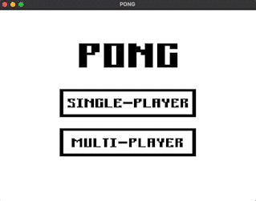

# PONG
Written with the AWESOME [ruby2d](http://www.ruby2d.com/) framework



Pong is a classic two-dimensional sports video game that simulates table tennis. The game features a simple, rectangular game area divided into two halves, with each player controlling a paddle to hit a small ball back and forth between them. The objective of the game is to score points by making the ball past the opponent's paddle and into their goal area.

In this version of Pong, the game is played to 10 points, with the first player to reach this score declared the winner. The game can be played in two modes: single-player mode against an AI opponent or multi-player mode that requires two players to use keyboard keys to move their paddles. In single-player mode, the AI opponent's paddle is controlled by the computer, and the player must try to outmaneuver the opponent to score points. In multi-player mode, two players can compete against each other using the keyboard keys to move their respective paddles. The game is easy to learn and provides a fun, fast-paced challenge that can be enjoyed by players of all ages and skill levels.
## Goals

- Expand code to make stylistic, personal-preference, and game-logic changes.
- Add 'Main Menu' that includes player mode options.
- Add level selection options based on player mode selection.
- Add player score keeping functionality.
- Add 'win' menu.
- Add ability to 'pause', 'reset', and 'repeat' game.
- Learn more about the Ruby2D framework.
- Learn more about game coordinate systems in 2D computer graphics.
- Learn to formulate an AI player/opponent.
- Learn more about single & multi-player game dev.
- Integrate game logic with graphics.
- Increase pixel art creating skills.
- And as always, have fun and keep improving Ruby programming knowledge.

# Install

Make sure you have installed:

* [ruby2d](https://github.com/ruby2d/ruby2d):

```
gem install ruby2d
```

Then clone the source code to your local.

# Play

```
cd pong
cd lib
ruby pong.rb
```

Game controls:

Single-Player Mode
* Left Paddle: 'up' & 'down' key
* Pause: space bar
* Reset (game over): 'r' key
* Restart (game over): 'escape' key

Multi-Player Mode
* Left Paddle: 'q' key = up & 'a' key = down
* Right Paddle: 'p' key = up & 'l' key = down
* Pause: space bar
* Reset (game over): 'r' key
* Restart (game over): 'escape' key


# Credits 

Basic structure based on following tutorial from [Mario Visic](https://github.com/mariovisic/ruby2d-games/tree/main/03%20-%20Pong)!

All images created by: fullstackraven in [Pixilart](https://www.pixilart.com/draw)