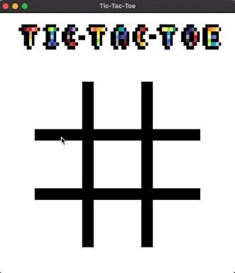

# Tic-Tac-Toe
A Ruby project from [The Odin Project](https://www.theodinproject.com/lessons/ruby-tic-tac-toe)

Written with the AWESOME [ruby2d](http://www.ruby2d.com/) framework



Tic-tac-toe is a two-player game, classically played with paper-and-pencil, in which players take turns marking either an "X" or an "O" in a 3x3 grid. The player who succeeds in placing three of their marks in a horizontal, vertical, or diagonal row wins the game. If all nine squares are filled and no player has three in a row, the game ends in a draw. Tic-tac-toe is a simple, quick game that can be played almost anywhere, making it a popular choice for children and adults alike.

## Goals

- Learn the Ruby2D framework
- Learn more about game coordinate systems in 2D computer graphics.
- Integrate game logic with graphics.
- Increase pixel art creating skills.
- And as always, have fun and keep improving Ruby programming knowledge.

# Install

Make sure you have installed:

* [ruby2d](https://github.com/ruby2d/ruby2d):

```
gem install ruby2d
```

Then clone the source code to your local.

# Play

```
cd tic-tac-toe
cd lib
ruby main.rb
```

Game controls:

X starts:
* Mouse click on any open board space
* Restart (game over): 'x' key


# Credits 

All images created by: fullstackraven in [Pixilart](https://www.pixilart.com/draw)
